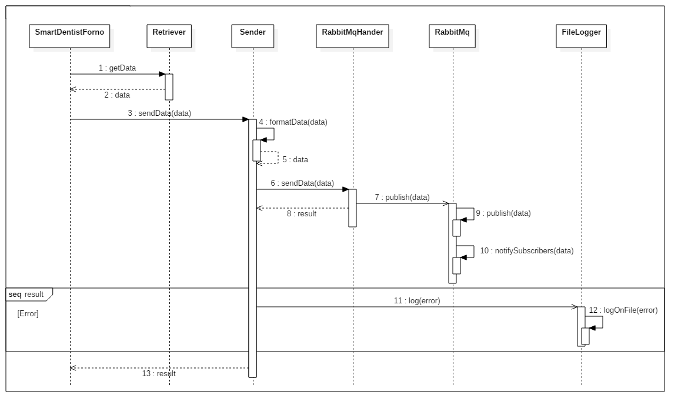

# Progetto Smart-Dentist

Grandinetti Francesco
Tutor Didattico: Morigi Serena
Tutor Aziendale: Sabbioni Andrea
Azienda: Imola Informatica
30 Aprile 2018 - 20 Luglio 2018

## Introduzione

Durante la mia esperienza di tirocinio a Imola Informatica sono stato assegnato ad un progetto che aveva lo scopo di realizzare un forno dentistico il quale ogni qual volta eseguisse l'accensione inviasse la sua posizione geografica ad un server per tenere traccia di tutti i suoi spostamenti.

## Tecnologie

Come piattaforma di sviluppo si è inizialmente optato per uno sviluppo su OpenShift, un Platform as a Service per applicazioni cloud, in modo tale da poter concentrare principalmente il lavoro sullo sviluppo dell'applicazione, demandando alla piattaforma stessa tutto ciò che riguarda l'ambito di amministrazione del sistema. Successivamente però si è virato in direzione di uno sviluppo sulla piattaforma dei container, così da poter osservare anche una parte di System Administrator; nello specifico si è optato per Docker e Docker Compose.
Come database per il sistema sono stati analizzati sia database relazionali come PostgreSql che database noSql come MongoDb.
Lato programmazione si è usato Python per programmare sia sul frontend che sul backend dell'applicazione: lato backend si è usato il framework Django per realizzare un server REST, mentre sul frontend si è costruito un broker collegato a un coda di messaggi di tipo RabbitMq per potere gestire l'invio di più dati in contemporanea da parte di forni diversi.
Infine per poter realizzare una webApp con cui l'utente finale potesse interagire, si è inserito nel sistema e personalizzato tutto l'ELK Stack, quindi Elasticsearch, Logstash e Kibana.

## Attività

### Analisi del forno

#### 1. Connessione alla rete

Il primo aspetto da affrontare riguarda l'ottenimento della connessione ad internet del dispositivo, aspetto fondamentale per poter poi comunicare qualunque tipo di dato necessario.
La connessione può essere ottenuta fisicamente, attraverso quindi l'installazione di una scheda di rete con relativa porta a cui connettere il cavo, e in aggiunta in modalità wireless, per rendere meno invasivo il dispositivo senza dover essere limitati da un elemento hardware. 
Non è detto che la connessione sia direttamente disponibile al forno stesso, infatti può presentare un modulo Bluetooth che gli permette di collegarsi alla rete tramite un gateway di un qualsiasi tipo (per esempio un dispositivo mobile) il quale poi comunicherà il dato in questione.

#### 2. Ottenimento della posizione

Per poter ottenere la posizione del dispositivo si possono utilizzare tre metodi, a seconda della disponibilità della rete oppure dell'interfacciamento diretto con l'utente:

1. tramite installazione di un dispositivo GPS che permette la localizzazione del dispositivo attraverso longitudine e latitudine.
2. tramite le informazioni di geolocalizzazione ottenute tramite le rete wireless stessa; questo è possibile solamente se è disponibile una rete WiFi, inoltre è anche da considerarare come l'informazione ottenuta non è sempre precisa quanto quella ottenuta dal metodo 1.
3. tramite richiesta esplicita all'utente con conseguente risposta.

#### 3. Entità software presenti

Il software all'interno dei forni deve essere sviluppato in due moduli: un modulo che si occupa della raccolta delle informazioni, in questo caso la posizione, e un modulo che invece deve inviare i dati alla unità di memorizzazione tramite la rete. Non è detto che entrambi questi moduli debbano essere presenti all'interno del forno, si possono presentare le seguenti combinazioni:

- entrambi i moduli sono presenti sul forno

- il modulo software per la raccolta dei dati tramite il gps è presente sul forno, mentre il modulo software per l'invio dei dati è installato su un gateway esterno collegato al forno tramite Bluetooth
- il modulo software per la raccolta dei dati è presente su un terminale collegato al forno tramite Bluetooth, mentre il modulo software per l'invio dei dati è presente sul forno
- entrambi i moduli sono presenti all'esterno del forno stesso, in questo caso la connessione con il forno serve principalmente per ottenere un identificativo utile a riconoscere il forno.

---

---

---

---

#### 4. Connessione fra l'entità composta forno e lato cliente

Una volta ottenuta la posizione in uno qualsiasi dei precedenti metodi, sarà compito del dispositivo comunicare i dati con una struttura apposita. Si possono utilizzare differenti architetture: si parte dal semplice client-server, per passare ad una architettura di tipo Publisher-Subscriber, e terminare ad una architettura sempre di tipo client-server ma più corposa di elementi, quali una webApp per esempio. 

---

---

### Sviluppo del sistema

Lato frontend si è realizzato un container in grado di gestire un numero indefinito di forni in contemporanea, ciascuno realizzato con un servizio differente; i forni sono stati realizzati attraverso tecnologie differenti: un tipo è rappresentato da una semplice pagina HTML nella quale un form invia i dati della posizione direttamente al server di backend, mentre l'altro è caratterizzato dall'invio dei dati indirettamente al server passando da una coda Rabbit presente come differente servizio sempre all'interno dello stesso container.
Questa tipologia di forno è costituita da tre moduli interni: il primo, denominato Retriever, che genera dati randomicamente in modo tale da simulare un possibile modulo GPS, il secondo, denominato Sender, il cui compito è quello di inviare dati alla coda, ed infine un terzo che fa da controller e gestisce gli altri due moduli andando a richiedere periodicamente i dati al Retriever dopo di che li invia tramite il Sender.

Collegato alla coda è presente un ulteriore servizio, anch'esso scomposto in moduli in modo analogo alla struttura realizzata per i forni: è presente un modulo Receiver che aspetta che dei messaggi siano presenti sulla coda, un secondo modulo, chiamato Sender, che invia i dati al backend attraverso messaggi HTTP, ed infine un controller che aspetta di essere notificato dal Receiver della presenza di un dato nella coda e nel momento stesso in cui avviene preleva i dati e li invia al server tramite il Sender.

Lato backend invece si è costruito un container contenente un servizio in cui è stato realizzato un server Django supportato da un database PostgreSql, presente in un differente servizio sempre all'interno dello stesso container; ogni qual volta il server viene contattato ad una determinata pagina tramite una POST salva nel db i dati ricevuti.
Per poter fornire all'utente finale i dati memorizzati nel db si è deciso di inserire all'interno del container l'ELK Stack in cui ciascun elemento fosse un servizio a se stante comunicante con gli altri. Il server, una qual volta ha salvato i dati sul db, tramite Logstash memorizzerà i dati anche su Elasticsearch da cui Kibana, su richiesta dell'utente, andrà a prelevare i dati per visualizzarli su una mappa insieme all'orario in cui il determinato forno ha inviato la sua posizione.

La struttura del sistema è rappresentata dalla seguente immagine, dove il numero di forni è puramente indicativo:

Per poter capire meglio come funziona l'invio dei dati da un forno al server di backend si possono vedere i seguenti diagrammi di sequenza

### Evoluzione del sistema

Subito dopo aver terminato la prima versione del sistema si è pensato ad un suo possibile sviluppo, ovvero l'accensione o lo spegnimento da remoto.

Si è perciò inserita una pagina sul server di backend attraverso la quale si potesse andare ad interagire con i dispositivi, indicandone l'identificativo e lo stato in cui sarebbe dovuto essere. 

Congiuntamente si è lavorato dal punto di vista del frontend andando a modificare la struttura della message queue, andandola a gestire con i topic: uno adibito per il log delle posizioni e che quindi vedesse il flusso dei dati dai forni verso il broker, un altro con lo stesso identico flusso con però il compito di indicare il cambiamento di stato "spontaneo" di un forno e infine un topic adibito per l'ordine da parte di un utente di cambiare stato ad un dispositivo, con flusso inverso quindi dal broker al forno in questione.

Per la comunicazione fra frontend e backend per andare ad indicare il cambiamento di stato di un dispositivo, si è inizialmente optato per una comunicazione a polling, dove quindi il broker andasse periodicamente a chiedere lo stato di tutti i dispositivi, dopo di che comunicava a ciascuno di loro quale dovesse essere il loro stato attuale: per fare ciò si è adibita una pagina sul server di backend che se contattata restituisse una pagina strutturata in JSON che contenesse gli identificativi dei dispositivi memorizzati con il loro stato.

Successivamente si voleva potenziare il sistema inserendo i Server Sent Events ma per la struttura adottata risulta molto difficile, questo perchè Django è un server che tende a non mantenere le connessioni ma le chiude una qual volta ha restituito la pagina richiesta. Una possibile naturale evoluzione del sistema quindi prevede una ulteriore message queue tra broker e server per gestire questa serie di messaggi

---

# Malacopia

Un forno dentistico è un macchinario che permette di riscaldare a temperature elevate, intorno ai 1300/1600 °C, dei materiali ceramici, permettendo la realizzazione di qualunque tipo di oggetto utile per lo svolgimento del lavoro di un dentista, come protesi, corone, ponti e molto altro. I prezzi variano in base alle dimensioni; per forni ben realizzati e di grosse dimensioni il costo è intorno ai 2000€.

Dato che per dover comunicare la propria posizione il dispositivo deve essere in qualche modo collegato ad una rete internet (questo argomento verrà trattato meglio nei paragrafi successivi) si potrebbe sfruttare l'occasione per rendere l'elemento più smart, inviando anche dati di utilità come temperatura di utilizzo, tempo impiegato per la cottura insieme ad altri dati in modo tale da poter tenere sotto controllo il macchinario e utilizzare questi dati sotto numerosi campi:

- da parte del costruttore per sapere cosa migliorare nelle successive versioni grazie a problematiche che si verificano frequentemente in una certa zona o sotto certe condizioni di utilizzo
- da parte del consumatore per notare in anticipo possibili rotture e anticipare così la manutenzione, in modo tale da non rovinare il macchinario e poterlo usare più a lungo