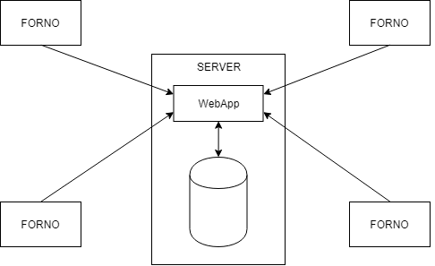
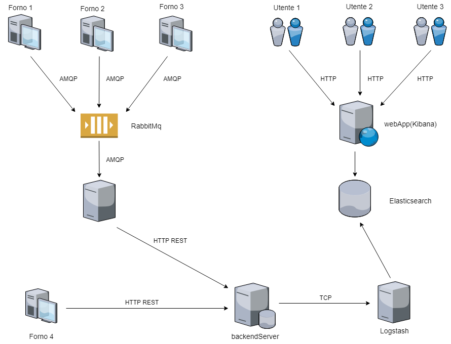

# Progetto Smart-Dentist

Grandinetti Francesco
Tutor Didattico: Morigi Serena
Tutor Aziendale: Sabbioni Andrea
Azienda: Imola Informatica
30 Aprile 2018 - 20 Luglio 2018

## Introduzione

Durante la mia esperienza di tirocinio a Imola Informatica sono stato assegnato ad un progetto che aveva lo scopo di realizzare un forno dentistico il quale ogni qual volta eseguisse l'accensione inviasse la sua posizione geografica ad un server per tenere traccia di tutti i suoi spostamenti durante il tempo.

Un forno dentistico è un macchinario che permette di riscaldare a temperature elevate, intorno ai 1300/1600 °C, dei materiali ceramici, permettendo la realizzazione di qualunque tipo di oggetto utile per lo svolgimento del lavoro di un dentista, come protesi, corone, ponti e molto altro. I prezzi variano in base alle dimensioni; per forni ben realizzati e di grosse dimensioni il costo è intorno ai 2000€.

Dato che per dover comunicare la propria posizione il dispositivo deve essere in qualche modo collegato ad una rete internet (questo argomento verrà trattato meglio nei paragrafi successivi) si potrebbe sfruttare l'occasione per renderlo più smart, inviando anche dati di utilità come temperatura di utilizzo, tempo impiegato per la cottura insieme ad altri dati in modo tale da poter tenere sotto controllo il macchinario e utilizzare questi dati sotto numerosi campi:

- da parte del costruttore per sapere cosa migliorare nelle successive versioni grazie a problematiche che si verificano frequentemente in una certa zona o sotto certe condizioni di utilizzo
- da parte del consumatore per notare in anticipo possibili rotture e anticipare così la manutenzione, in modo tale da non rovinare il macchinario e poterlo usare più a lungo

## Tecnologie utilizzate

Durante l'attività sono state viste numerose tecnologie
Si è inizialmente optato come piattaforma di sviluppo OpenShift, un Platform as a Service per applicazioni cloud, in modo tale da poter concentrare principalmente il lavoro sullo sviluppo della applicazione, demandando alla piattaforma stessa tutto ciò che riguarda l'ambito di amministrazione del sistema. Successivamente però per facilità di replicazione su un sistema differente si è deciso di lavorare tramite tecnologia container utilizzando nello specifico Docker e Docker Compose.
Come database per il sistema si è usato un database noSql, MongoDb.
Lato programmazione si è usato Python per programmare sia sul frontend che sul backend dell'applicazione: nello specifico lato server si è usato Django per realizzare un server REST. Si è inoltre utilizzato sul frontend un broker collegato a un coda di messaggi di tipo RabbitMq per potere gestire l'invio di più dati in contemporanea da parte di forni diversi.

## Attività

### Analisi del forno

#### 1. Connessione alla rete

Il primo aspetto da affrontare riguarda l'ottenimento della connessione ad internet del dispositivo, aspetto fondamentale per poter poi comunicare qualunque tipo di dato necessario.
La connessione può essere ottenuta fisicamente, attraverso quindi l'installazione di una scheda di rete con relativa porta a cui connettere il cavo, e in aggiunta in modalità wireless, per rendere meno invasivo il dispositivo senza dover per forza utilizzare un cavo per la connessione. 
Non è detto che la connessione sia direttamente disponibile al forno stesso, infatti può presentare un modulo Bluetooth che gli permette di collegarsi alla rete tramite un gateway di un qualsiasi tipo (per esempio un dispositivo mobile).

#### 2. Ottenimento della posizione

Per poter ottenere la posizione del dispositivo si possono utilizzare tre metodi, a seconda della disponibilità della rete oppure dell'interfacciamento diretto con l'utente:

1. tramite installazione di un dispositivo GPS che permette la localizzazione del dispositivo attraverso longitudine e latitudine.
2. tramite le informazioni di geolocalizzazione ottenute tramite le rete wireless stessa; questo è possibile solamente se è disponibile una rete WiFi, inoltre è anche da considerarare come l'informazione ottenuta non è sempre precisa quanto quella ottenuta dal metodo 1.
3. tramite la richiesta e la consecutiva risposta da parte dell'utente stesso.

#### 3. Entità software presenti

Il software all'interno dei forni deve essere sviluppato in due moduli: un modulo che si occupa della raccolta delle informazioni, in questo caso la posizione, e un modulo che invece deve inviare i dati alla unità di memorizzazione tramite la rete. Non è detto che entrambi questi moduli debbano essere presenti all'interno del forno, si possono presentare le seguenti combinazioni:

- entrambi i moduli presenti sul forno

- modulo software per la raccolta dei dati tramite il gps presente sul forno + modulo software per l'invio dei dati su un gateway esterno collegato al forno tramite Bluetooth
- modulo software per la raccolta dei dati presente su un terminale collegato al forno tramite Bluetooth + modulo software per l'invio dei dati presente sul forno
- entrambi i moduli presenti all'esterno del forno stesso, in questo caso la connessione con il forno serve principalmente per ottenere un identificativo utile a riconoscere il forno.

---

---

---

---

#### Connessione fra l'entità composta forno e lato cliente

Una volta ottenuta la posizione in uno qualsiasi dei precedenti metodi, sarà compito del dispositivo comunicare i dati con una struttura apposita.

---

---

### Sviluppo del sistema

Lato frontend si è realizzato un container in grado di gestire un numero indefinito di forni in contemporanea, ciascuno realizzato con un servizio differente; possono essere di due tipi: un tipo è rappresentato da una semplice pagina HTML con un form che invia i dati della posizione direttamente al server di backend, mentre l'altro tipo è caratterizzato dal fatto di inviare i dati indirettamente al server passando da una coda Rabbit presente come differente servizio sempre all'interno dello stesso container.
Il secondo tipo di forno è realizzato con due moduli interni: uno, denominato Retriever, che genera dati randomicamente in modo tale da simulare un possibile modulo GPS, ed un altro, denominato Sender, il cui compito è quello di inviare dati alla coda.
Collegato alla coda è presente un ulteriore servizio, anch'esso scomposto in moduli in modo analogo alla struttura realizzata per i forni: è presente un modulo Receiver che aspetta che dei messaggi siano presenti sulla coda, dopo di che non appena ne è presente almeno uno lo preleva e lo consegna al secondo modulo, chiamato Sender, che invia i dati al backend attraverso messaggi HTTP.

Lato backend invece si è realizzato un server Django supportato da un database Postgres che ogni qual volta venisse contattato ad una determinata pagina tramite una POST salva nel db i dati ricevuti; per poter fornire i dati memorizzati nel db all'utente finale si è realizzata una webApp.

La struttura del sistema è rappresentata dalla seguente immagine, dove il numero di forni è puramente indicativo:

## Conclusioni

In questa parte lo studente trae le conclusioni del lavoro svolto,
valutando pregi e difetti dell’esperienza e, più specificamente, riassumendo quanto
appreso.

## Bibliografia

Questa sezione, opzionale, include i riferimenti a manuali, testi e
articoli scientifici eventualmente consultati durante il lavoro, ordinati per cognome
del primo autore.

---

# Malacopia

all'interno della quale verranno memorizzati i dati: questa struttura potrebbe essere un database distribuito che memorizzerà l'identificativo della macchina, la sua posizione e data e ora della ricezione dei dati così da sapere quando e dove è stato attivato l'ultima volta.

Sarà poi l'utente ad interfacciarsi con questo database attraverso una applicazione web o addirittura un'applicazione mobile per poter filtrare il determinato macchinario e sapere tutti i vari spostamenti che questo ha effettuato ultimamente o in un dato periodo di tempo.

### Architettura pub-sub[^1]

È comoda perchè permette di realizzare un'architettura scalabile e indipendente dal tipo di problema che si sta affrontando.

Pro per il sistema attuale:

- è scalabile, perciò è indipendente dal numero di forni che si possono collegare al sistema e di conseguenza usare per ricevere informazioni.
- interpone tra i forni e il database una struttura ulteriore, che permette al database di non ricevere informazioni contemporaneamente e creare quindi condizioni di corsa critica nella scrittura
- in caso di più informazioni inviate dai forni, grazie al concetto intrinseco dell'architettura si potrebbero filtrare le informazioni da memorizzare su diversi database in base al contenuto senza che i forni debbano conoscere la differenza fra un database che contenga solo dati di log e un altro dove vengono memorizzate le informazioni di utilità. Sempre grazie a questo principio di intermediario si dà la possibilità di ottenere informazioni dai forni anche nel caso in cui per una serie di operazioni di mantenimento i database si dovessero scollegare dal sistema per un periodo di tempo
- permetterebbe di poter considerare un messaggio di log contemporaneamente come due informazioni distinte: sia come nuovo dato da aggiungere al database per aggiornarne l'history, sia per notificare un certo utente, il quale ha deciso di essere notificato, che il forno è stato accesso e renderlo partecipe con poco ritardo e in maniera dinamica, senza che questo si debba per forza collegare ad un sito e verificare i log passati

Contro:

- si va ad aggiungere al sistema un'architettura non necessaria per la natura del problema allo stato attuale
- si potrebbe causare un certo ritardo nella memorizzazione delle informazioni

Per mantenere una certa astrazione del sistema, la modalità migliore adatta a questo caso è quella type-based.

[^1]: L'argomento è stato analizzato con il documento reperito [a questo indirizzo](https://infoscience.epfl.ch/record/165428/files/10.1.1.10.1076.pdf)

### Differenze fra database relazionali e database NoSql

|                        |                        Db relazionali                        |                           NoSql db                           |
| ---------------------- | :----------------------------------------------------------: | :----------------------------------------------------------: |
| Relazioni              | Le relazioni fra i vari elementi sono presenti e sono l'elemento caratterizzante del sistema; tutti i dati hanno la stessa struttura | Le relazioni possono essere presenti, ma non sono il punto centrale del database in quanto gli elementi possono anche non avere nulla in comune dal punto di vista della struttura interna |
| Struttura              |                          Verticale                           |                         Orizzontale                          |
| Scalabilità            |         Poca, dovuta al tipo di struttura impiegata          |                           Elevata                            |
| Disponibilità dei dati |                   I dati sono disponibili                    | Elevata, è un aspetto principale su cui si basano questi tipi di database |
| Consistenza dei dati   |                I dati sono sempre consistenti                | Presente ma meno rispetto a quelli relazionali, in questo caso si parla di "Eventuale consistenza": i dati che si leggono in un determinato istante non è detto che siano aggiornati all'ultima versione presente nel database |

## 